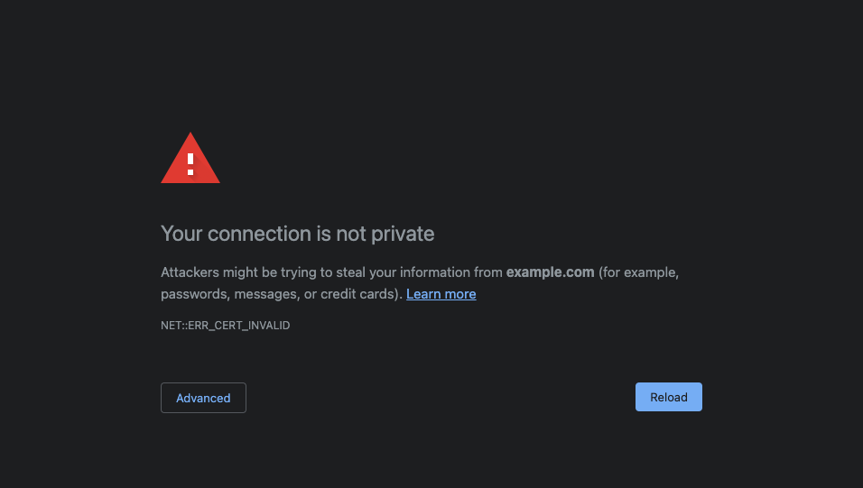

# Cross Origin playground

This repository is for testing cross origin environment.

Write below configuration in `/etc/hosts`.

```
127.0.0.1 example.com
127.0.0.1 example.net
```

And execute below command.

```sh
docker compose up
```

Then you can access example.com and example.net that served by docker compose.

## Warning on Chrome when access the sites

You may see below warning.



Then you need to type `thisisunsafe` to access example.com or example.net.

## Configuration sites page

Edit `example.com/index.html` and `examle.net/index.html` to change the contents.
You can treat `example.com/` and `examle.net/` like `/usr/share/nginx/html`
directory.
